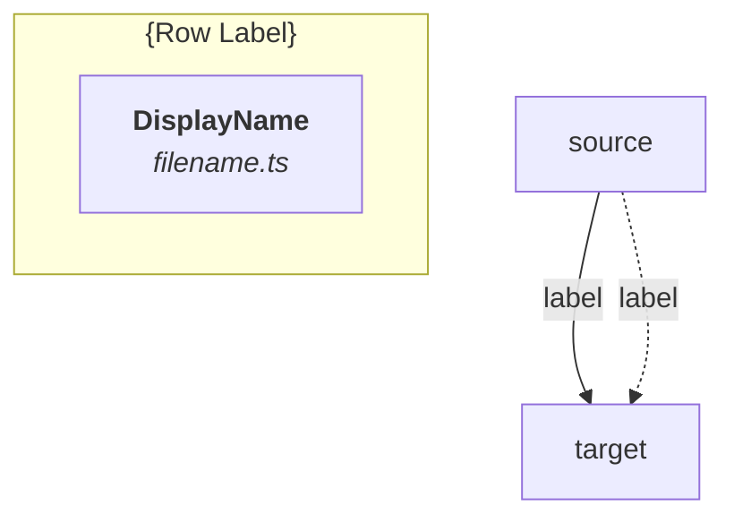

# Dependency Graph Generator

Build a layered Mermaid dependency diagram from one or more code entry points.

## Phase 1 — Gather Requirements

Use AskQuestion to collect:

### 1. Entry points

Ask: "Which functions, hooks, providers, or components should I trace? (names or file paths)"

This is free-text — the user provides names like `useQueryUserAccounts`, `AccountProvider`, or paths like `src/features/me/hooks/useUserAccounts.ts`.

### 2. Dependency types

Ask with multi-select:

| Option | What it traces |
|--------|---------------|
| **Hook calls** | `useX()` calls inside the function body |
| **GraphQL queries** | `useQuery`, `useSuspenseQuery`, `useMutation` with document imports |
| **Context providers** | React context providers consumed (`useContext`, custom context hooks) |
| **HOC wrappers** | `withX()` higher-order components |
| **All of the above** | Everything |

Default: **All of the above**

### 3. Depth

Ask: "How many levels deep should I trace?"

| Option | Behavior |
|--------|----------|
| **Bounded (default: 3)** | Trace up to N levels of parents and children |
| **Full tree** | Trace recursively until no more dependencies found |
| **Immediate only** | Direct parents and children only (depth 1) |

Default: **Bounded at 3 levels**

### 4. Output location

Ask: "Where should I save the diagram?"

Default: suggest a filename based on the entry points, e.g. `dependency-graph-useQueryUserAccounts.md` in the project root.

---

## Phase 2 — Trace Dependencies

Launch parallel explore subagents to trace the graph. For each entry point, trace both directions.

### Tracing parents (what does this symbol depend on?)

For each file, look for:

- **Hook calls**: any `useX(...)` call in the function body → find the definition file
- **GraphQL documents**: imports of `*Document` passed to `useQuery`/`useSuspenseQuery`/`useMutation`
- **Context reads**: `useContext(XContext)` or custom context hooks like `useUserState`
- **Direct imports**: named imports from other project files (not node_modules)

### Tracing children (what consumes this symbol?)

Search the codebase for:

- **Import references**: `grep` for the export name across `.ts`/`.tsx` files
- **Hook consumers**: files that call `useX()` where X is the traced symbol
- **Provider wrappers**: files that render `<XProvider>` or use `withX()` HOC

### Classifying nodes

Assign each discovered node a **type**:

| Type | How to identify | Mermaid style |
|------|----------------|---------------|
| `graphql-query` | File imports a `*Document` and passes it to a query/mutation hook | Green parallelogram `[/"..."/]` |
| `data-hook` | Custom hook that fires a GraphQL query | Purple rectangle |
| `context-provider` | Exports a React context `Provider` component | Orange rectangle |
| `composition-hook` | Custom hook that calls other hooks but fires no query | Pink rectangle |
| `component` | React component (JSX return) | Gray rectangle |
| `hoc` | Higher-order component (`withX`) | Dashed border rectangle |
| `deprecated` | Has `@deprecated` JSDoc tag | Red rectangle |

### Data to collect per node

```
- id: sanitized name for Mermaid (no special chars)
- label: display name
- file: relative file path
- type: one of the types above
- query_name: (if graphql-query) the operation name
- query_fields: (if graphql-query) root fields summary
- edges_to: list of { target_id, label } for outgoing dependencies
```

---

## Phase 3 — Build the Layered Diagram

### Row assignment algorithm

1. **Find roots**: nodes with no parents in the traced set
2. **Find leaves**: nodes with no children in the traced set
3. **Assign layers by longest path from root** (topological sort):
   - Layer 0 = GraphQL queries (always top row if present)
   - Remaining nodes: layer = 1 + max(layer of all parents)
4. **Group nodes into subgraphs by layer**

### Row naming convention

Assign descriptive names to each row based on the node types it contains:

| Primary type in row | Row label |
|---------------------|-----------|
| `graphql-query` | "GraphQL Queries" |
| `data-hook` (root, no hook parents) | "Root Data Hooks" |
| `context-provider` | "Context Providers" |
| `data-hook` (has hook parents) | "Data-Fetching Hooks" |
| `composition-hook` | "Composition Hooks" |
| `component` | "Components" |

If a row has mixed types, use the dominant type for naming.

### Mermaid template

Generate the diagram following this structure:

````markdown

````

### Style palette

| Node type | fill | stroke | color |
|-----------|------|--------|-------|
| `graphql-query` | `#e8f5e9` | `#2e7d32` | `#1b5e20` |
| `data-hook` (root) | `#e3f2fd` | `#1565c0` | `#0d47a1` |
| `context-provider` | `#fff3e0` | `#e65100` | `#bf360c` |
| `data-hook` (leaf) | `#f3e5f5` | `#6a1b9a` | `#4a148c` |
| `composition-hook` | `#fce4ec` | `#880e4f` | `#880e4f` |
| `component` | `#f5f5f5` | `#616161` | `#212121` |
| `deprecated` | `#ffebee` | `#c62828` | `#b71c1c` |

### Edge conventions

| Meaning | Mermaid syntax |
|---------|---------------|
| Fires a GraphQL query | `-.->` (dotted) with query hook name as label |
| Depends on another hook/provider | `-->` (solid) with consumed export as label |

---

## Phase 4 — Generate Output Document

Write a markdown file with these sections:

1. **Title** — "Dependency Graph: {entry point names}"
2. **Mermaid diagram** — the layered graph
3. **Legend** — table mapping row colors to meanings, edge styles to meanings
4. **Node inventory** — table: Name, File, Type, Query (if any), Direct dependents count
5. **Key observations** — bullet list of notable findings (duplicates, circular deps, over-fetching, deprecated usage)

---

## Reference: Example Output

See [dependency-graph-example.md](dependency-graph-example.md) for a complete example of the output format (the account context dependency graph).
