# Account Context — Hook & Query Dependency Graph

**Ticket:** RETIRE-1874
**Date:** 2026-02-18

## Mermaid Diagram

```mermaid
graph TD
    %% ════════════════════════════════════════
    %% Row 1 — GraphQL Queries (data sources)
    %% ════════════════════════════════════════
    subgraph queries ["GraphQL Queries"]
        direction LR
        GetMe[/"GetMe<br/><code>me { ...MeDto }</code><br/><code>savers { ...SaversDto }</code>"/]
        GetAccount[/"GetAccount<br/><code>defconAccountGroupById(id)</code><br/><code>{ ...AccountGroupDto }</code>"/]
        GetCapabilities[/"GetAccountsCapabilities<br/><code>savers.accounts(state:ALL)</code><br/><code>{ capabilities, state }</code>"/]
        GetDetails[/"GetAccountDetails<br/><code>savers.account(accountNumber)</code><br/><code>{ display, accountType }</code>"/]
    end

    %% ════════════════════════════════════════
    %% Row 2 — Root data hook
    %% ════════════════════════════════════════
    subgraph root ["Root Data Hook"]
        useQueryUserAccounts["<b>useQueryUserAccounts</b><br/><i>useUserAccounts.ts</i>"]
    end

    %% ════════════════════════════════════════
    %% Row 3 — Context providers (no queries)
    %% ════════════════════════════════════════
    subgraph providers ["Context Providers (no direct queries)"]
        direction LR
        UserProvider["<b>UserProvider</b><br/><i>user.provider.tsx</i>"]
        AccountNumbersProvider["<b>AccountNumbersProvider</b><br/><i>account-numbers.provider.tsx</i>"]
    end

    %% ════════════════════════════════════════
    %% Row 4 — Leaf hooks (fire their own queries)
    %% ════════════════════════════════════════
    subgraph leaf ["Data-Fetching Hooks"]
        direction LR
        AccountProvider["<b>AccountProvider</b> ⚠️ deprecated<br/><i>account.provider.tsx</i>"]
        useDefconAccountGroup["<b>useDefconAccountGroup</b><br/><i>useDefconAccountGroup.tsx</i>"]
        useAccountCapabilities["<b>useAccountCapabilities</b><br/><i>useAccountCapabilities.ts</i>"]
        useAccountDetails["<b>useAccountDetails</b><br/><i>useAccountDetails.tsx</i>"]
        useDefconOffboarding["<b>useDefconOffboarding</b><br/><i>useDefconOffboarding.ts</i><br/>(no query — navigation only)"]
    end

    %% ════════════════════════════════════════
    %% Row 5 — Composition hooks (no queries)
    %% ════════════════════════════════════════
    subgraph composition ["Composition Hooks (no direct queries)"]
        useFilteredAccountsByState["<b>useFilteredAccountsByState</b><br/><i>useFilteredAccountsByState.ts</i>"]
    end

    %% ── Styles ──
    style queries fill:#e8f5e9,stroke:#2e7d32,color:#1b5e20
    style root fill:#e3f2fd,stroke:#1565c0,color:#0d47a1
    style providers fill:#fff3e0,stroke:#e65100,color:#bf360c
    style leaf fill:#f3e5f5,stroke:#6a1b9a,color:#4a148c
    style composition fill:#fce4ec,stroke:#880e4f,color:#880e4f

    style GetMe fill:#e8f5e9,stroke:#2e7d32,color:#1b5e20
    style GetAccount fill:#e8f5e9,stroke:#2e7d32,color:#1b5e20
    style GetCapabilities fill:#e8f5e9,stroke:#2e7d32,color:#1b5e20
    style GetDetails fill:#e8f5e9,stroke:#2e7d32,color:#1b5e20

    style useQueryUserAccounts fill:#e3f2fd,stroke:#1565c0,color:#0d47a1
    style UserProvider fill:#fff3e0,stroke:#e65100,color:#bf360c
    style AccountNumbersProvider fill:#fff3e0,stroke:#e65100,color:#bf360c
    style AccountProvider fill:#ffebee,stroke:#c62828,color:#b71c1c
    style useDefconAccountGroup fill:#f3e5f5,stroke:#6a1b9a,color:#4a148c
    style useAccountCapabilities fill:#f3e5f5,stroke:#6a1b9a,color:#4a148c
    style useAccountDetails fill:#f3e5f5,stroke:#6a1b9a,color:#4a148c
    style useDefconOffboarding fill:#f3e5f5,stroke:#6a1b9a,color:#4a148c
    style useFilteredAccountsByState fill:#fce4ec,stroke:#880e4f,color:#880e4f

    %% ── Query → Hook edges (dotted = fires this query) ──
    GetMe -.->|useSuspenseQuery| useQueryUserAccounts
    GetAccount -.->|useSuspenseQuery| AccountProvider
    GetAccount -.->|useSuspenseQuery / useQuery| useDefconAccountGroup
    GetCapabilities -.->|useSuspenseQuery| useAccountCapabilities
    GetDetails -.->|useSuspenseQuery| useAccountDetails

    %% ── Root → Providers ──
    useQueryUserAccounts -->|full return| UserProvider
    useQueryUserAccounts -->|supportedUnifiedAccounts| AccountNumbersProvider

    %% ── Providers → Leaf hooks ──
    UserProvider -->|useUserState selectors| AccountProvider
    UserProvider -->|useUserState selectors| useDefconOffboarding
    AccountNumbersProvider -->|useAccountNumbers| AccountProvider
    AccountNumbersProvider -->|useAccountNumbers| useDefconAccountGroup
    AccountNumbersProvider -->|useAccountNumbers| useAccountDetails
    AccountNumbersProvider -->|useAccountNumber| useAccountCapabilities

    %% ── Into composition layer ──
    useQueryUserAccounts -->|supportedUnifiedAccounts| useFilteredAccountsByState
    AccountNumbersProvider -->|useAccountNumbers| useFilteredAccountsByState
    useAccountCapabilities -->|useMapAccountNumberToGroupId| useFilteredAccountsByState
```



## Legend

| Row | Color | Meaning |
|---|---|---|
| 1 | 🟢 Green | GraphQL queries (data sources) |
| 2 | 🔵 Blue | Root data hook (`useQueryUserAccounts`) |
| 3 | 🟠 Orange | Context providers (no direct queries, derive & re-provide) |
| 4 | 🟣 Purple / 🔴 Red | Data-fetching hooks (fire their own queries). Red = deprecated |
| 5 | 🩷 Pink | Composition hooks (no queries, combine data from above) |

| Edge style | Meaning |
|---|---|
| Dotted (`-.->`) | Hook executes this GraphQL query |
| Solid (`-->`) | Hook/provider depends on another hook/provider |

## Queries at a Glance

| Query | Document | Root field | Used by |
|---|---|---|---|
| `GetMe` | `GetMeDocument` | `me` + `savers` | `useQueryUserAccounts` |
| `GetAccount` | `GetAccountDocument` | `defconAccountGroupById` | `AccountProvider`, `useDefconAccountGroup` |
| `GetAccountsCapabilities` | `GetAccountsCapabilitiesDocument` | `savers.accounts` | `useAccountCapabilities` |
| `GetAccountDetails` | `GetAccountDetailsDocument` | `savers.account` | `useAccountDetails` |

## Dependency Chains (text form)

```
GetMe
 └─► useQueryUserAccounts
      ├─► UserProvider (context)
      │    ├─► AccountProvider ──► GetAccount (DUPLICATE with useDefconAccountGroup)
      │    └─► useDefconOffboarding (no query, navigation only)
      ├─► AccountNumbersProvider (no query, derives account numbers)
      │    ├─► useDefconAccountGroup ──► GetAccount
      │    ├─► useAccountDetails ──► GetAccountDetails
      │    ├─► useAccountCapabilities ──► GetAccountsCapabilities
      │    │    └─► useFilteredAccountsByState (no query, composition)
      │    └─► AccountProvider (also reads account numbers)
      └─► useFilteredAccountsByState (also reads supportedUnifiedAccounts directly)
```

## Key Observations

1. **4 distinct GraphQL queries** power the entire account context system
2. **`GetAccount` is fired twice** — once by `AccountProvider` and once by `useDefconAccountGroup` (same query, same fragment, separate cache entries)
3. **`useQueryUserAccounts`** is the root of the dependency tree — everything else flows from it directly or indirectly
4. **`AccountNumbersProvider`** is the critical bridge — 4 out of 5 data-fetching hooks depend on it for their account number input
5. **`useFilteredAccountsByState`** is the most complex composition — it pulls from 3 separate sources (`useQueryUserAccounts`, `useAccountNumbers`, `useMapAccountNumberToGroupId`)
6. **No query** — `useDefconOffboarding` and `useFilteredAccountsByState` fetch no data themselves; they compose/consume existing data
