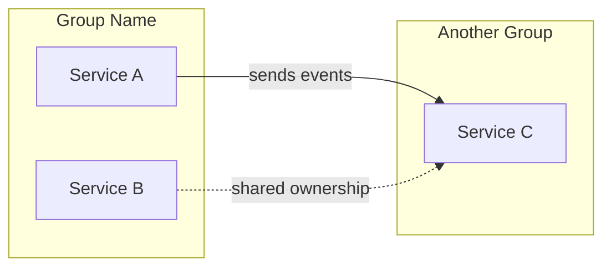
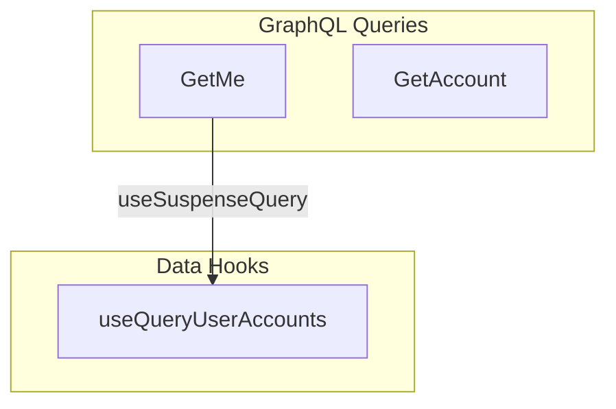

# Output: FigJam via Figma MCP

How to generate the diagram in FigJam using the Figma MCP plugin.

## Prerequisites

Before generating, verify the Figma MCP is connected:
- Use `ToolSearch` to find `mcp__plugin_figma_figma__generate_diagram`
- If not available, tell the user to connect the Figma plugin first, then fall back to Mermaid markdown output

## FigJam Constraints

FigJam's Mermaid renderer has significant limitations. Follow these strictly:

- **No `style` directives** — FigJam ignores them entirely. Do not rely on colors to convey meaning. Use node placement and labeling instead.
- **No emojis** — FigJam cannot render emoji characters in labels.
- **No `\n`** — Newline escapes don't work. Use ` ` sparingly if needed, but test.
- **Short subgraph names** — Keep under ~25 characters. Long names truncate without warning.
- **Node IDs** — Use short, arbitrary IDs (`nd1`, `nd2`). Do NOT use domain acronyms as IDs — a node ID `SSN` could be confused with "Social Security Number" when reading the Mermaid source.

## Layout Rules

- **Direction**: `flowchart LR` (left-to-right) by default for architecture diagrams. `flowchart TD` only for simple hierarchies or decision trees.
- **Label every arrow**: Every edge MUST have a label in quotes. No unlabeled arrows — if you can't name the relationship, reconsider whether it belongs.
- **Quote all text**: All node labels and edge labels in double quotes (e.g., `["Label"]`, `-->|"Edge Label"|`).
- **Arrow budget**: 15-20 for simple domains, up to 25 for complex. Beyond 25, split into multiple diagrams. Err on completeness — users can remove nodes in FigJam, but missing systems are harder to spot.
- **Node ordering**: Declare nodes in flow order. Dagre lays out in declaration order — inputs first, then processing, then outputs reduces arrow crossings.
- **Edge ordering**: Group edges by direction. Define all forward edges before cross-subgraph edges. Mixing directions causes routing collisions.
- **Reduce fan-out**: If one node connects to 5+, introduce an intermediate aggregator node (e.g., "Risk Signals") to funnel arrows through a single point.
- **Subgraph direction**: Override parent direction with `direction TB` or `direction LR` inside individual subgraphs.

## Edge Conventions

| Meaning | Syntax |
|---|---|
| Direct dependency / data flow | `-->` (solid) with relationship label |
| Cross-team / shared responsibility | `-.->` (dashed) with label |
| Fires a query (code-level) | `-.->` (dotted) with hook name |

## Template: Architecture-Level

## Template: Code-Level

Since FigJam ignores styles, use subgraph grouping to communicate node types instead of colors:

## Generating

Call `mcp__plugin_figma_figma__generate_diagram` with the Mermaid syntax string.

After generating:
1. Share the returned FigJam URL as a clickable markdown link
2. Frame the output: **"This is a first draft — the layout will need manual adjustment in FigJam, and I expect 2-3 rounds of label and arrow corrections."**
3. Mention that the diagram was generated via Figma MCP so viewers know they can edit it in FigJam

## Context Nodes

Some nodes show organizational context (team ownership, platform dependencies) rather than data flow. Their placement within a subgroup communicates their role — not every node needs an arrow. Note context nodes so the user can add flow arrows in FigJam later.
