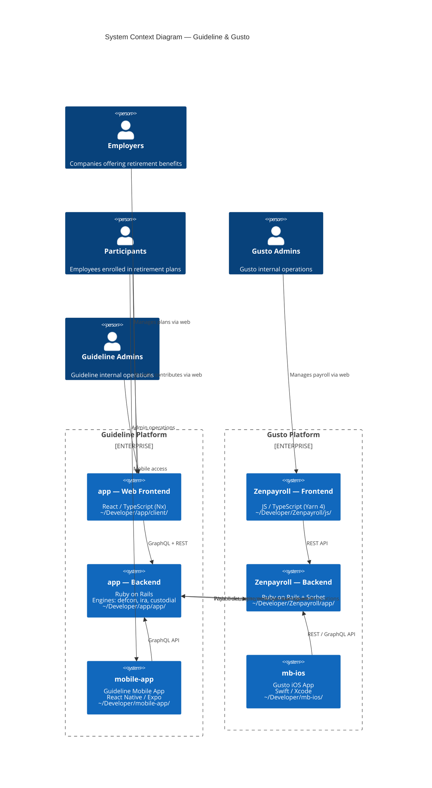

# Project Landscape

All projects live in `~/Developer/`. This skill documents the system context (C1), tech stacks, and how to explore across repos.

## C1 Context Diagram



### Key Relationships

| From | To | Integration |
|------|----|-------------|
| `app` Web Frontend | `app` Backend | GraphQL + REST (same monorepo) |
| `mobile-app` | `app` Backend | GraphQL API |
| `Zenpayroll` Frontend | `Zenpayroll` Backend | REST API |
| `mb-ios` | `Zenpayroll` Backend | REST / GraphQL API |
| `app` Backend | `Zenpayroll` Backend | Payroll data sync, employer/participant integrations |
| `Zenpayroll` Backend | `app` Backend | Webhooks, retirement plan management |

## Project Registry

### app — Guideline Monorepo

| Property | Value |
|----------|-------|
| **Path** | `~/Developer/app` |
| **Repo** | [guideline-app/app](https://github.com/guideline-app/app) |
| **Stack** | Ruby on Rails (backend) + React/TypeScript in Nx monorepo (frontend) |
| **Databases** | 12+ (primary, accounting, ledger, payroll_platform, etc.) |
| **Testing** | Minitest (backend), Vitest (frontend) |
| **Jobs** | Sidekiq, Karafka (Kafka) |
| **Org** | Engines (`defcon/`, `ira/`, `custodial/`) + Subsystems (`auth/`, `billing/`, etc.) |
| **Key dirs** | `app/`, `client/`, `engines/`, `subsystems/`, `lib/`, `config/` |
| **Has AGENTS.md** | Yes — read it for full dev commands and architecture |

### mobile-app — Guideline Mobile App

| Property | Value |
|----------|-------|
| **Path** | `~/Developer/mobile-app` |
| **Repo** | [guideline-app/mobile-app](https://github.com/guideline-app/mobile-app) |
| **Stack** | React Native (Expo), TypeScript |
| **Runtime** | Node 24, npm |
| **Testing** | Jest / Maestro (E2E) |
| **GraphQL** | Codegen against `app` backend schema |
| **Key dirs** | `src/`, `app/`, `e2e/` |

### Zenpayroll — Gusto Backend

| Property | Value |
|----------|-------|
| **Path** | `~/Developer/Zenpayroll` |
| **Repo** | [Gusto/zenpayroll](https://github.com/Gusto/zenpayroll) |
| **Stack** | Ruby on Rails monolith, Ruby 3.4 |
| **Frontend** | JS/TS (Yarn 4) |
| **Typed** | Sorbet (`sorbet/`) |
| **Key dirs** | `app/`, `packs/`, `components/`, `lib/`, `config/`, `js/` |

### mb-ios — Gusto iOS App

| Property | Value |
|----------|-------|
| **Path** | `~/Developer/mb-ios` |
| **Repo** | [Gusto/mb-ios](https://github.com/Gusto/mb-ios) |
| **Stack** | Swift, Xcode |
| **Architecture** | Modular Swift packages (AddressKit, GustoLoginKit, GustoBenefits, etc.) |
| **Key dirs** | `Gus/`, `AddressKit/`, `GustoLoginKit/`, `FeatureCoordination/` |

## Exploring Other Codebases

When the user asks about code in a different repo, or you need cross-repo context:

### 1. Read files directly

All repos are local. Use absolute paths:

```
~/Developer/mobile-app/src/...
~/Developer/Zenpayroll/app/...
~/Developer/mb-ios/Gus/...
~/Developer/app/engines/...
```

### 2. Search across repos

Use Grep or Glob with the target repo path:

- Search Zenpayroll for an API endpoint: `Grep pattern="def some_action" path="~/Developer/Zenpayroll/app"`
- Find a Swift file in mb-ios: `Glob pattern="**/*ViewModel.swift" target_directory="~/Developer/mb-ios"`
- Search mobile-app for a screen: `Grep pattern="SomeScreen" path="~/Developer/mobile-app/src"`

### 3. Check AGENTS.md / CLAUDE.md first

Before deep-diving into another repo, check for setup docs:

```
~/Developer/<repo>/AGENTS.md
~/Developer/<repo>/CLAUDE.md
~/Developer/<repo>/README.md
```

These contain dev commands, architecture overviews, and testing instructions specific to that repo.

### 4. Use subagents for deep exploration

For thorough cross-repo investigation, launch an `explore` subagent scoped to the target repo directory. This avoids polluting the current conversation context.

## Common Cross-Repo Tasks

| Task | Where to look |
|------|---------------|
| GraphQL schema that mobile-app consumes | `~/Developer/app/app/graphql/` |
| How Gusto sends payroll data to Guideline | `~/Developer/Zenpayroll/` for sender, `~/Developer/app/engines/payroll/` for receiver |
| How mobile-app authenticates | `~/Developer/mobile-app/src/` for client, `~/Developer/app/subsystems/auth/` for backend |
| Gusto iOS feature modules | `~/Developer/mb-ios/` — each module is a Swift package directory |
| Guideline 401(k) engine | `~/Developer/app/engines/defcon/` |
| Guideline IRA engine | `~/Developer/app/engines/ira/` |
